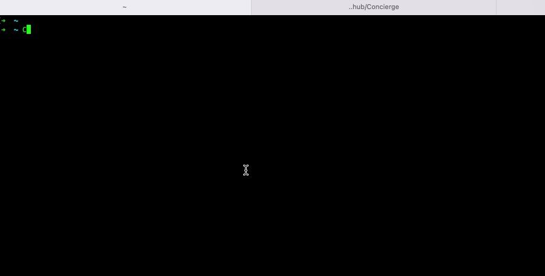

# Concierge

Concierge is a Cloud compliance tool which uses [CloudConformity API](https://cloudone.trendmicro.com/docs/conformity/api-reference/) to evaluate the compliance status of AWS CloudFormation template files and stacks.

The idea was previously implemented in [cfn-compliance-check](https://github.com/jc1518/cfn-compliance-check).

Why re-write it in Go?

- Learn some Go
- Write Once, Run Anywhere (WORA)
- More features

## Install

- Install from source: `go install github.com/jc1518/Concierge@latest`
- Download compiled binary from [released versions](https://github.com/jc1518/Concierge/releases)

## Usage

1.  Setup CloudConformity API key environment variable `CLOUD_CONFORMITY_API_KEY` (You should be able to create one in CloudConformity console `User settings > API Keys` if you don't have one yet).

2.  Setup your AWS credential (e.g. environment variables, profile or EC2 instance role).

3.  Follow the usage:

    ```
    Usage of Concierge:
    -stacks-arn string
        CloudFormation stacks ARN, use comma to seperate if more than one
    -template-file string
        CloudFormation template file (json or yaml)
    ```

    - Example: Check compliance status of a CloudFormation stack

      `Concierge -stacks-arn arn:aws:cloudformation:ap-southeast-2:123456789000:stack/my-stack/69d48220-010d-11ec-982a-06dd10360dfc`

    - Example: Check compliance status of a CloudFormation template file

      `Concierge -template-file ./my-stack.yml`

## Demo


